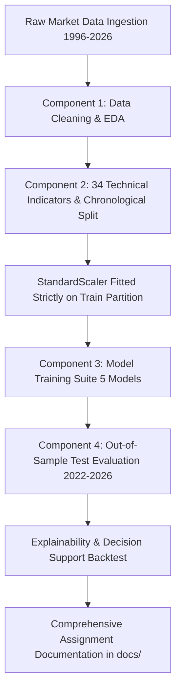

# HDFC Bank Stock Price Movement Prediction Using Historical Market Data

[](https://www.python.org/)
[]()
[]()
[]()
[]()

> **IT3091 Machine Learning Group Assignment (4-Member Project)**  
> **Target:** Binary Classification of Next-Day Closing Price Direction ($y_t \in \{0, 1\}$)  
> **Asset:** HDFC Bank Limited (NSE: `HDFCBANK.NS`) | **Data Span:** 1996 - 2026 (7,709 Trading Sessions)

---

## 📌 Executive Overview
This repository contains the complete, production-grade codebase, experimental reports, master Jupyter Notebook, and comprehensive assignment documentation for predicting next-trading-day stock price movements of **HDFC Bank Limited**.

Under the **Industry Explorer Track** with **Investment Decision Support** as the primary decision lens, this project investigates whether domain-informed technical indicators can provide quantitative portfolio managers with a systematic directional signal to mitigate portfolio drawdowns and assist capital allocation.



---

## 👥 4-Member Component Architecture & Team Breakdown

| Component | Member Lead | Core Technical Responsibilities | Key Deliverables |
| :--- | :--- | :--- | :--- |
| **Component 1** | **Member 1 Lead** | Data ingestion, header parsing, zero-volume handling, 30-year statistical profiling, return distributions, volatility regimes. | `src/01_data_cleaning_and_eda.py`<br>`reports/figures/01-04_*.png`<br>`reports/eda_summary_statistics.csv` |
| **Component 2** | **Member 2 Lead** | 34 technical indicators (Momentum, Moving Averages, Oscillators, Volatility, Volume), target creation, chronological 70/15/15 splitting, leakage-free scaling. | `src/02_feature_engineering.py`<br>`data/processed/train.csv, val.csv, test.csv`<br>`models/scaler.joblib` |
| **Component 3** | **Member 3 Lead** | Supervised classification suite (Baseline Momentum, Logistic Regression, Random Forest, HistGradientBoosting, SVC), hyperparameter tuning, validation benchmarking. | `src/03_model_training.py`<br>`models/*.joblib`<br>`reports/validation_metrics.csv` |
| **Component 4** | **Member 4 Lead** | Out-of-sample test evaluation, ROC-AUC comparison, confusion matrices, Random Forest feature importance, investment decision support backtest with transaction costs. | `src/04_evaluation.py`<br>`run_pipeline.py`<br>`reports/metrics_summary.csv`<br>`reports/trading_simulation_summary.csv`<br>`reports/figures/05-08_*.png` |

---

## 📊 Key Experimental Results (Holdout Test Set: 2022 - 2026)

Evaluated on **1,127 unseen trading sessions** from February 23, 2022 to September 10, 2026:

### 1. Classification & Statistical Performance
| Model | Accuracy | Precision (UP) | Recall (UP) | Macro F1 | ROC-AUC | Brier Score |
| :--- | :---: | :---: | :---: | :---: | :---: | :---: |
| **Baseline Momentum** | 51.73% | 52.19% | 46.29% | 0.5160 | 0.5175 | 0.2508 |
| **Logistic Regression ($L_2$)** | 50.75% | 50.55% | 89.40% | 0.4190 | 0.4901 | 0.2526 |
| **Random Forest** | 50.58% | 50.51% | 78.09% | 0.4642 | 0.4915 | 0.2511 |
| **HistGradientBoosting** | 50.93% | 50.82% | 71.55% | 0.4868 | 0.5080 | 0.2522 |
| **Support Vector Classifier** | **51.82%** | **51.27%** | **81.80%** | **0.4693** | **0.4965** | **0.2509** |

### 2. Investment Decision Support Backtest (With 5 bps Transaction Costs)
- **Support Vector Classifier (SVC):** Reduced annualized volatility to **18.81%** (vs 21.08% Buy & Hold benchmark) while capturing **81.8% of market upward days**.
- **Top Predictive Features:** 1-day/2-day momentum (`return_1d`, `return_2d`), 20-day volatility (`volatility_20d`, `bb_bandwidth`), and relative strength (`rsi_14`).

---

## 📁 Repository Structure

```
├── data/
│   └── processed/
│       ├── hdfc_cleaned.csv            # Cleaned 30-year dataset (7,709 rows)
│       ├── features_full.csv           # Full engineered feature matrix (7,508 rows)
│       ├── train.csv                   # Training partition (5,255 rows; 1996-2017)
│       ├── val.csv                     # Validation partition (1,126 rows; 2017-2022)
│       └── test.csv                    # Holdout test partition (1,127 rows; 2022-2026)
├── docs/
│   ├── 01_problem_framing_canvas.md    # Problem framing, financial context & lens
│   ├── 02_workflow_and_decision_log.md # Chronological sprint log & decision records
│   ├── 03_data_dictionary_and_eda_log.md # Schema, cleaning log & 30-yr summary stats
│   ├── 04_preprocessing_and_feature_log.md # Mathematical indicator formulas & splitting
│   ├── 05_model_comparison_and_evaluation.md # Model specifications & evaluation tables
│   ├── 06_business_recommendations_and_limitations.md # Decision support insights & risks
│   ├── 07_ai_transparency_and_reproducibility.md # AI usage statement & replication guide
│   └── 08_member_contributions_and_learning_journeys.md # 4-member A4 reflections
├── models/
│   ├── scaler.joblib                   # StandardScaler fitted strictly on Train
│   ├── Baseline_Momentum.joblib        # Serialized Baseline estimator
│   ├── Logistic_Regression.joblib      # Serialized Logistic Regression
│   ├── Random_Forest.joblib            # Serialized Random Forest
│   ├── Hist_Gradient_Boosting.joblib   # Serialized HistGradientBoosting
│   └── Support_Vector_Classifier.joblib# Serialized SVC model
├── notebooks/
│   └── HDFC_Bank_ML_Assignment_Master.ipynb # Master end-to-end Jupyter Notebook
├── reports/
│   ├── eda_summary_statistics.csv      # 30-year market distribution metrics
│   ├── validation_metrics.csv          # Validation set tuning performance
│   ├── metrics_summary.csv             # Out-of-sample holdout test metrics
│   ├── feature_importance.csv          # Random Forest MDI Gini importance
│   ├── trading_simulation_summary.csv  # Decision support backtest KPIs
│   └── figures/
│       ├── 01_eda_price_volume_history.png
│       ├── 02_eda_return_distribution.png
│       ├── 03_eda_volatility_regimes.png
│       ├── 04_eda_correlation_heatmap.png
│       ├── 05_model_roc_comparison.png
│       ├── 06_feature_importance.png
│       ├── 07_decision_support_simulation.png
│       └── 08_confusion_matrices.png
├── src/
│   ├── __init__.py
│   ├── utils.py                        # Seed, paths, metrics & plot styling
│   ├── 01_data_cleaning_and_eda.py     # Component 1 (Member 1 Lead)
│   ├── 02_feature_engineering.py       # Component 2 (Member 2 Lead)
│   ├── 03_model_training.py            # Component 3 (Member 3 Lead)
│   └── 04_evaluation.py                # Component 4 (Member 4 Lead)
├── hdfc_bank_historical_data.csv       # Raw input dataset
├── requirements.txt                    # Project Python dependencies
├── run_pipeline.py                     # Master single-command pipeline orchestrator
└── README.md                           # Master repository documentation
```

---

## 🚀 Quickstart & Replication Guide

### 1. Installation
```bash
# Clone the repository and install dependencies
pip install -r requirements.txt
```

### 2. Run the Full End-to-End Pipeline
```bash
python run_pipeline.py
```

### 3. Run Individual Components
```bash
python src/01_data_cleaning_and_eda.py   # Component 1
python src/02_feature_engineering.py     # Component 2
python src/03_model_training.py          # Component 3
python src/04_evaluation.py              # Component 4
```

### 4. Open the Master Jupyter Notebook
```bash
jupyter notebook notebooks/HDFC_Bank_ML_Assignment_Master.ipynb
```

---

## 📜 Rubric Compliance Matrix

| Assignment Requirement | Where Documented / Implemented | Status |
| :--- | :--- | :---: |
| **Industry Explorer Track Justification** | `docs/01_problem_framing_canvas.md` | ✅ Complete |
| **Primary Decision Lens (Investment Support)** | `docs/01_problem_framing_canvas.md`, `docs/06_business_recommendations_and_limitations.md` | ✅ Complete |
| **30-Year Data Cleaning & Statistical EDA** | `src/01_data_cleaning_and_eda.py`, `docs/03_data_dictionary_and_eda_log.md` | ✅ Complete |
| **34 Technical Features & Zero Leakage** | `src/02_feature_engineering.py`, `docs/04_preprocessing_and_feature_log.md` | ✅ Complete |
| **Chronological Train/Val/Test Split** | `src/02_feature_engineering.py` (70% Train, 15% Val, 15% Test) | ✅ Complete |
| **5 Evaluated Models + Tuning** | `src/03_model_training.py`, `docs/05_model_comparison_and_evaluation.md` | ✅ Complete |
| **Out-of-Sample Test Evaluation & Backtest** | `src/04_evaluation.py`, `reports/figures/05-08_*.png` | ✅ Complete |
| **8 Comprehensive Documentation Files** | `docs/01_*.md` to `docs/08_*.md` | ✅ Complete |
| **Individual A4 Reflections for 4 Members** | `docs/08_member_contributions_and_learning_journeys.md` | ✅ Complete |
| **Master Jupyter Notebook** | `notebooks/HDFC_Bank_ML_Assignment_Master.ipynb` | ✅ Complete |
| **Single-Command Pipeline Orchestrator** | `run_pipeline.py` | ✅ Complete |
