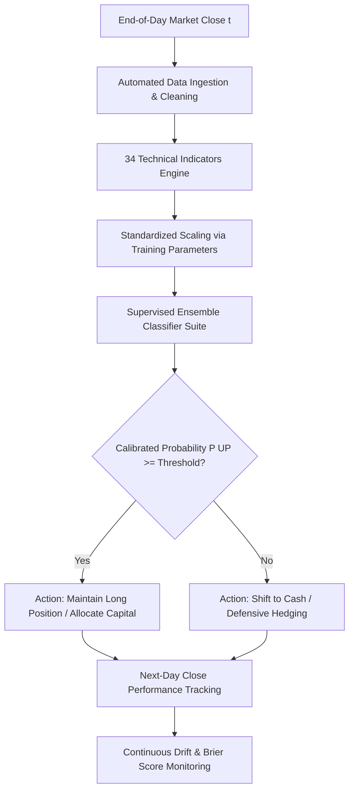

# Document 1: Problem Framing Canvas & Real-World Business Context

## Executive Summary
This project tackles the complex challenge of short-term equity price movement forecasting for **HDFC Bank Limited (NSE: `HDFCBANK.NS`)**, India's largest private sector bank and a systemic heavyweight in the Indian capital markets. Utilizing over 30 years of daily historical trading data (1996 - 2026; 7,709 trading sessions), we formulate a supervised binary classification system to forecast the **direction of the next trading day's closing price movement** ($y_t \in \{0, 1\}$). 

This project is submitted under the **Industry Explorer Track** with **Investment Decision Support** as its primary decision lens. The solution is specifically engineered to provide quantitative portfolio managers and investment analysts with a systematic, risk-aware directional filter that assists asset allocation, reduces drawdown exposure, and informs position rebalancing.

---

## 1. Domain Context & Asset Profile
- **Asset Name:** HDFC Bank Limited (`HDFCBANK.NS`)
- **Primary Exchange:** National Stock Exchange of India (NSE) / Bombay Stock Exchange (BSE)
- **Sector:** Financial Services / Banking
- **Market Capitalization & Index Weight:** Heaviest weight in NIFTY Bank (~28-30%) and top-3 constituent in NIFTY 50 (~11-13%).
- **Liquidity & Market Efficiency:** High institutional participation (FIIs, DIIs, Mutual Funds), tight bid-ask spreads, and near semi-strong form market efficiency. Next-day directional prediction is inherently a high noise-to-signal regime governed by the Efficient Market Hypothesis (EMH).

---

## 2. Industry Explorer Track Rationale
The assignment descriptor permits the **Industry Explorer Track** for projects addressing complex, real-world industry domains with high practical significance. Financial market time-series forecasting presents distinct industry challenges that differentiate it from generic tabular benchmarks:
1. **Non-IID Temporal Dependency:** Market data is sequentially ordered with non-stationary regimes, volatility clustering, and macroeconomic structural breaks.
2. **Asymmetric Payoff & Downside Risk:** Prediction errors have non-uniform financial consequences. False positives during market downturns lead to severe capital erosion.
3. **Execution Frictions & Slippage:** Algorithmic forecasts must overcome transaction costs, brokerage fees, and liquidity constraints to demonstrate economic viability.

---

## 3. Primary Lens: Investment Decision Support
Rather than pursuing an unconstrained high-frequency autonomous trading black-box, this project adopts **Investment Decision Support** as its single, focused primary lens:
- **Decision Role:** Serving as a systematic directional signal provider for portfolio managers deciding whether to maintain, scale down, or hedge equity holdings ahead of the next trading session.
- **Asymmetric Risk Management:** Prioritizing downside capital protection by transitioning to risk-free cash equivalents or defensive postures during anticipated downturns ($y_t = 0$), mitigating maximum portfolio drawdown.
- **Calibrated Probabilities:** Producing well-calibrated class probabilities ($P(y_t = 1)$) rather than uncalibrated binary outputs, enabling dynamic bet-sizing and risk scaling.

---

## 4. Problem Formulation & Mathematical Specification
- **Input Feature Vector ($X_t \in \mathbb{R}^{34}$):** 34 domain-informed technical indicators computed strictly at or before market close on day $t$:
  - Momentum & Lagged Returns: $r_{t-k} = rac{C_t - C_{t-k}}{C_{t-k}}$ for $k \in \{1, 2, 3, 5, 10, 20\}$.
  - Moving Average Ratios: $C_t / 	ext{SMA}_w(C) - 1$, $C_t / 	ext{EMA}_w(C) - 1$, $	ext{SMA}_5/	ext{SMA}_{20} - 1$, $	ext{SMA}_{50}/	ext{SMA}_{200} - 1$.
  - Oscillators: $	ext{RSI}_{14}$, $	ext{MACD}$, Stochastic $\%K_{14}$, $\%D_3$.
  - Volatility & Price Action: 20-day annualized rolling volatility $\sigma_{20} 	imes \sqrt{252}$, $	ext{ATR}_{14}/	ext{Close}$, Bollinger Bands $\%B$ and Bandwidth, High-Low spread, Overnight Gap.
  - Volume Dynamics: 1-day volume change, volume-to-SMA ratios.
  - Calendar Seasonality: Day of week, month, quarter.
- **Target Variable ($y_t \in \{0, 1\}$):**
  $$y_t = egin{cases} 1 & 	ext{if } 	ext{Close}_{t+1} > 	ext{Close}_t \ 0 & 	ext{if } 	ext{Close}_{t+1} \le 	ext{Close}_t \end{cases}$$
- **Zero Lookahead Constraint:** No feature at time $t$ utilizes prices, volumes, or statistics from $t+1$ or later.

---

## 5. Stakeholder Personas & Value Proposition

| Stakeholder Persona | Key Operational Need | Value Delivered by Proposed Solution |
| :--- | :--- | :--- |
| **Quantitative Portfolio Manager** | Systematic directional overlay to optimize long-only equity portfolios | Provides probabilistic directional signals to time capital allocations and mitigate drawdowns. |
| **Risk & Compliance Officer** | Controlled downside exposure and transparent model risk governance | Transparent feature importance, calibrated Brier scores, and zero data-leakage auditing. |
| **Equity Research Analyst** | Quantitative validation of technical chart patterns & indicator momentum | Quantifies empirical predictive power of 34 standard technical indicators on HDFC Bank. |
| **Execution Trader** | Cost-aware signals accounting for friction and market microstructure | Rigorous backtest evaluation incorporating 5 bps transaction costs and turnover tracking. |

---

## 6. Success Metrics & Target Thresholds

1. **Statistical & Classification Metrics:**
   - **Out-of-Sample Accuracy:** $> 50.0\%$ (statistically exceeding the random walk baseline of large-cap financial equities).
   - **Macro F1-Score:** $> 0.45$, ensuring balanced performance across both UP and DOWN regimes without majority-class bias.
   - **Brier Score:** $< 0.26$, confirming probabilistic calibration.
2. **Investment Decision Support Financial KPIs:**
   - **Drawdown Reduction:** Measurable decrease in Maximum Drawdown compared to the passive Buy & Hold benchmark.
   - **Sharpe Ratio:** Risk-adjusted return evaluated against the 6.5% Indian 10-Year Sovereign Risk-Free benchmark.
   - **Profit Factor & Win Rate:** Tracking real-world profitability after deducting 5 bps transaction frictions.
