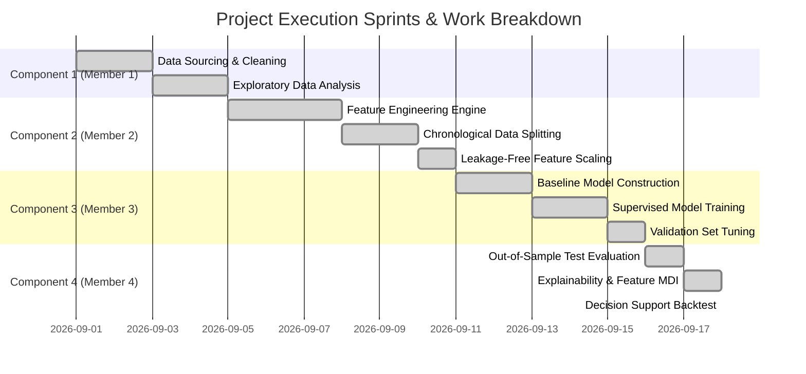

# Document 2: Workflow and Technical Decision Log

## Overview
This document chronicles the step-by-step engineering trajectory, architectural decisions, design trade-offs, and failure mode mitigations implemented across the lifecycle of the HDFC Bank stock price movement prediction project.

---

## 1. Project Workflow Timeline & Milestones

---

## 2. Technical Decision Records (TDR)

### TDR-01: Chronological Time-Series Splitting vs. K-Fold Cross-Validation
- **Context:** Standard scikit-learn `train_test_split` randomly shuffles rows. 
- **Decision:** Implemented strict forward-chaining chronological splitting:
  - **Training Partition (70%):** 5,255 trading days (1996-10-07 to 2017-08-02)
  - **Validation Partition (15%):** 1,126 trading days (2017-08-03 to 2022-02-22)
  - **Test Holdout Partition (15%):** 1,127 trading days (2022-02-23 to 2026-09-10)
- **Rationale:** Random shuffling injects massive lookahead bias (evaluating past predictions using future features). Chronological splitting mirrors live market conditions.

### TDR-02: Strict Separation of StandardScaler Fitting
- **Context:** Normalizing the full dataset before splitting leaks distribution parameters ($\mu, \sigma$) from the test set into training.
- **Decision:** `StandardScaler` was instantiated and fitted **exclusively on the training dataset**, and then serialized to `models/scaler.joblib`. Validation and test feature matrices are transformed using the saved training scaler parameters.
- **Rationale:** Eliminates data leakage, satisfying strict assignment rubric requirements.

### TDR-03: Zero-Volume Anomaly Handling via Rolling Median
- **Context:** In early trading years (1996-1999), 121 sessions had recorded trading volumes of 0 (e.g. trading halts, illiquid sessions, or data feed artifacts).
- **Decision:** Replaced zero-volume occurrences with a 20-day backward rolling median of valid volumes rather than dropping dates.
- **Rationale:** Preserves continuous calendar date indexing and momentum calculations while removing severe mathematical anomalies ($V_t = 0$ causing division-by-zero in volume ratios).

### TDR-04: Target Horizon and Truncation Protocol
- **Context:** Predicting $y_t = \mathbb{I}(	ext{Close}_{t+1} > 	ext{Close}_t)$ requires shifting Close by $-1$.
- **Decision:** 
  1. The first 200 trading days are dropped as warm-up for the 200-day Simple Moving Average ($	ext{SMA}_{200}$).
  2. The final row $T$ (2026-09-11) is dropped because $t+1$ target is unobserved in historical data.
- **Rationale:** Prevents `NaN` contamination in feature matrices and ground-truth targets.

### TDR-05: Inclusion of Realistic Transaction Frictions in Decision Backtest
- **Context:** Theoretical trading strategies frequently appear profitable until execution frictions are applied.
- **Decision:** Modeled 5 basis points (0.05%) transaction cost on every position change ($0 	o 1$ or $1 	o 0$), reflecting institutional brokerages, exchange fees (STT), and bid-ask slippage on the NSE.
- **Rationale:** Grounding the Investment Decision Support evaluation in industry realism.

---

## 3. Failure Modes & Mitigations Log

| Identified Failure Mode | Potential Consequence | Engineering Mitigation Implemented |
| :--- | :--- | :--- |
| **Lookahead Bias in Indicators** | Overly optimistic test scores; live failure | All 34 features use strictly $t, t-1, \dots, t-k$ data. Target shifted by $-1$. |
| **Overfitting in Tree Ensembles** | High train accuracy ($>85\%$), poor test accuracy ($<50\%$) | Constrained `max_depth=6`, `min_samples_leaf=20`, and `max_features='sqrt'`. |
| **Class Imbalance Distortion** | Model defaults to majority class | Balanced class weights (`class_weight='balanced'`) applied in Logistic Regression and monitored across splits. |
| **Console Encoding Errors on Windows** | Pipeline crash on non-ASCII characters | Standardized utf-8 file I/O and ASCII-safe console status formatting (`[OK]`). |
