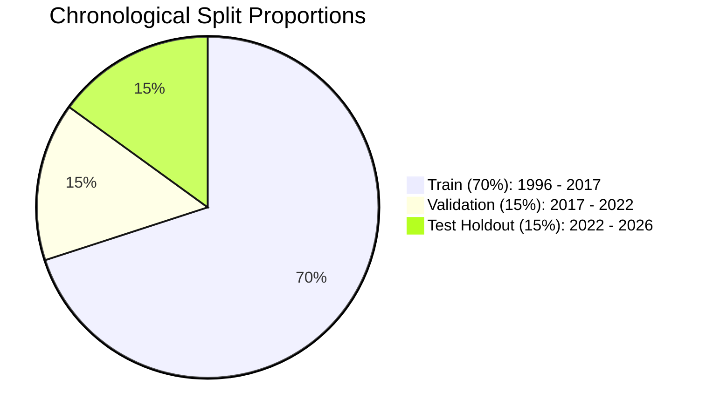

# Document 4: Preprocessing & Feature Engineering Pipeline Log

## 1. Feature Engineering Mathematical Formulations
To extract actionable signal from non-stationary financial price series without lookahead leakage, we engineer **34 technical indicators** across 6 distinct quantitative categories. All indicators are computed strictly at time $t$ using data up to $t$.

### Category 1: Price Momentum & Lagged Returns (6 Features)
Measures short-to-medium term rate of price change:
$$\text{return\_1d}_t = \frac{C_t - C_{t-1}}{C_{t-1}}, \quad \text{return\_2d}_t = \frac{C_t - C_{t-2}}{C_{t-2}}, \quad \text{return\_3d}_t = \frac{C_t - C_{t-3}}{C_{t-3}}$$
$$\text{return\_5d}_t = \frac{C_t - C_{t-5}}{C_{t-5}}, \quad \text{return\_10d}_t = \frac{C_t - C_{t-10}}{C_{t-10}}, \quad \text{return\_20d}_t = \frac{C_t - C_{t-20}}{C_{t-20}}$$

### Category 2: Moving Average Trend & Cross Ratios (9 Features)
Quantifies deviation from short, medium, and long-term trend lines:
- **SMA Ratios ($w \in \{5, 10, 20, 50, 200\}$):**
  $$\text{sma\_w\_ratio}_t = \frac{C_t}{\frac{1}{w}\sum_{i=0}^{w-1} C_{t-i}} - 1.0$$
- **EMA Ratios ($w \in \{12, 26\}$):**
  $$\text{ema\_w\_ratio}_t = \frac{C_t}{\text{EMA}_w(C)_t} - 1.0$$
- **Moving Average Convergence Ratios:**
  $$\text{sma\_5\_20\_ratio}_t = \frac{\text{SMA}_5(C)_t}{\text{SMA}_{20}(C)_t} - 1.0$$
  $$\text{sma\_50\_200\_ratio}_t = \frac{\text{SMA}_{50}(C)_t}{\text{SMA}_{200}(C)_t} - 1.0 \quad \text{(Golden / Death Cross proxy)}$$

### Category 3: Oscillators & Mean-Reversion Indicators (6 Features)
- **Relative Strength Index ($\text{RSI}_{14}$):**
  $$\text{RS}_t = \frac{\text{EMA}_{14}(\text{Gain})_t}{\text{EMA}_{14}(\text{Loss})_t + \epsilon}, \quad \text{RSI}_{14} = 100 - \frac{100}{1 + \text{RS}_t}$$
- **Normalized Moving Average Convergence Divergence (MACD):**
  $$\text{macd\_line}_t = \frac{\text{EMA}_{12}(C)_t - \text{EMA}_{26}(C)_t}{C_t}$$
  $$\text{macd\_signal}_t = \text{EMA}_9(\text{macd\_line})_t, \quad \text{macd\_diff}_t = \text{macd\_line}_t - \text{macd\_signal}_t$$
- **Stochastic Oscillator ($\%K_{14}, \%D_3$):**
  $$\%K_t = \frac{C_t - \min_{14}(L)}{\max_{14}(H) - \min_{14}(L) + \epsilon} \times 100, \quad \%D_t = \frac{1}{3}\sum_{i=0}^2 \%K_{t-i}$$

### Category 4: Volatility & Intraday Price Action (7 Features)
- **20-Day Annualized Rolling Volatility:**
  $$\text{volatility\_20d}_t = \text{std}(\text{return\_1d}_{t-19 \dots t}) \times \sqrt{252}$$
- **Average True Range (ATR Ratio):**
  $$\text{TR}_t = \max(H_t - L_t, |H_t - C_{t-1}|, |L_t - C_{t-1}|), \quad \text{atr\_14\_ratio}_t = \frac{\text{EMA}_{14}(\text{TR})_t}{C_t}$$
- **Bollinger Bands ($\%B$, Bandwidth):**
  $$\text{bb\_percent\_b}_t = \frac{C_t - (\text{SMA}_{20} - 2\sigma_{20})}{4\sigma_{20} + \epsilon}, \quad \text{bb\_bandwidth}_t = \frac{4\sigma_{20}}{\text{SMA}_{20}}$$
- **Intraday Spreads & Overnight Gap:**
  $$\text{hl\_spread}_t = \frac{H_t - L_t}{C_t}, \quad \text{co\_spread}_t = \frac{C_t - O_t}{O_t}, \quad \text{overnight\_gap}_t = \frac{O_t - C_{t-1}}{C_{t-1}}$$

### Category 5: Volume Indicators (3 Features)
- **1-Day Volume Return:** $\text{vol\_return\_1d}_t = (V_t - V_{t-1}) / V_{t-1}$
- **Volume SMA Ratios:** $\text{vol\_sma\_5\_ratio}_t = V_t / \text{SMA}_5(V) - 1.0$, $\text{vol\_sma\_20\_ratio}_t = V_t / \text{SMA}_{20}(V) - 1.0$

### Category 6: Calendar Seasonality (3 Features)
- `day_of_week` (0=Monday to 4=Friday; captures weekend gap effects)
- `month` (1=January to 12=December; captures seasonal fund flows)
- `quarter` (1 to 4; captures quarterly earnings cycles)

---

## 2. Chronological Splitting Strategy

- **Warm-Up Truncation:** 200 rows dropped at the start of the dataset to fully populate 200-day moving averages ($\text{SMA}_{200}$).
- **Target Shift Truncation:** Final row $T$ dropped since $y_T = \mathbb{I}(C_{T+1} > C_T)$ cannot be computed without unobserved future price.
- **Valid Observations:** 7,508 trading days (1996-10-07 to 2026-09-10).
- **Split Partitions:**
  - **Train:** 5,255 sessions ($49.19\%$ UP)
  - **Validation:** 1,126 sessions ($50.98\%$ UP)
  - **Test:** 1,127 sessions ($50.22\%$ UP)

---

## 3. Zero-Leakage Standardization
- **Methodology:** `StandardScaler` standardizes features $z = (x - \mu_{\text{train}}) / \sigma_{\text{train}}$.
- **Implementation:** `scaler.fit(X_train)` executed strictly on training rows.
- **Artifact:** Saved to `models/scaler.joblib`. Transformed arrays applied to validation and test sets.
