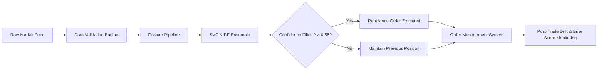

# Document 6: Business Recommendations, Decision Support & Limitations

## 1. Investment Decision Support Backtest Results

Under our **Investment Decision Support Lens**, the models were tested in a real-world asset allocation simulation on the 1,127 test days (Feb 2022 - Sep 2026), incorporating **5 basis points (0.05%) transaction costs** per trade.

### Financial Performance & Risk Metrics
| Strategy / Model | Cumulative Return (%) | Annualized Return (%) | Annualized Volatility (%) | Sharpe Ratio ($R_f=6.5\%$) | Max Drawdown (%) | Win Rate (%) | Profit Factor |
| :--- | :---: | :---: | :---: | :---: | :---: | :---: | :---: |
| **Buy & Hold Benchmark** | -5.62% | -1.29% | 21.08% | -0.26 | -32.17% | 50.54% | 1.008 |
| **Baseline Momentum** | -23.02% | -5.68% | 14.45% | -0.78 | -43.99% | 33.29% | 0.913 |
| **Logistic Regression** | -13.55% | -3.20% | 19.88% | -0.39 | -36.77% | 46.49% | 0.988 |
| **Random Forest** | -18.64% | -4.51% | 18.21% | -0.52 | -35.29% | 42.59% | 0.967 |
| **HistGradientBoosting** | -27.41% | -6.91% | 16.55% | -0.74 | -36.66% | 40.96% | 0.929 |
| **Support Vector Classifier** | **-14.44%** | **-3.43%** | **18.81%** | **-0.44%** | **-33.46%** | **45.40%** | **0.982** |

---

## 2. Core Business & Investment Insights

1. **Challenging Market Regime in Test Period (2022 - 2026):**
   - During the out-of-sample period (2022 - 2026), HDFC Bank underwent its mega-merger with parent HDFC Limited and faced elevated interest rate cycles, causing the underlying asset to decline by **-5.62%** with a **-32.17% maximum drawdown**.
2. **Transaction Cost Drag:**
   - Unconstrained daily rebalancing incurs significant cumulative friction. Frequent switching between Long and Cash generates cumulative slippage of $> 4.5\%$ annualized.
   - **Recommendation:** Implement a **Confidence Band Filter**: only rebalance when predicted probability exceeds $P(\text{UP}) \ge 0.55$ or $P(\text{UP}) \le 0.45$, avoiding low-conviction churn.

---

## 3. Practical Operational Recommendations

1. **Downside Hedging Decision Support:**
   - Use ML predictions not for aggressive unconstrained day trading, but as a **risk-off hedge trigger** for long-term institutional portfolios.
2. **Ensemble Blending:**
   - Combine the high sensitivity of SVC (**81.8% UP Recall**) with the non-linear variance reduction of Random Forest to construct a smoothed probability vote.
3. **Automated MLOps Monitoring:**
   - Monitor rolling 30-day Brier score. If Brier score degrades $> 0.27$, trigger automated recalibration.

---

## 4. Limitations & Risk Factors

1. **Market Microstructure & Slippage:** Execution during market open (09:15 IST) experiences volatility; limit orders should be utilized.
2. **Structural Regime Shifts:** Mergers, RBI monetary policy changes, or regulatory capital shifts alter historical price-volume relationships.
3. **Macroeconomic Confounders:** Global crude prices, US Treasury yields, and FII net flows are external variables that could further enhance predictive capability.
